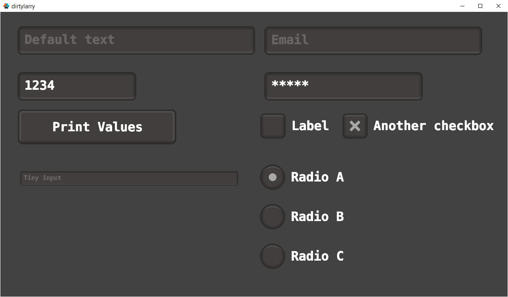
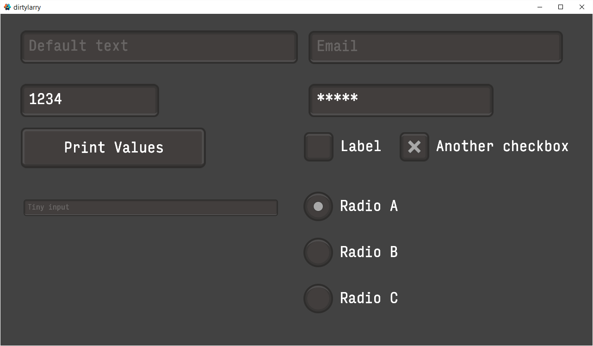

# DefUI
Fork of dirtylarry GUI library with extra themes and functionality. This is a hard fork which is not meant to be compatible with dirtylarry, but projects can be adapted and content could be added from this to dirtylarry library.

# TODO
* make themes better to add
* need to disable hover / input on other UI while touch click is held down start on another - take/releas focus
* holding down input while moving around over a button should not make its image state change like it currently does
* color picker
* circular progress bar
* alerts
* modal popup
* knobs
* progress bar
* option list
* rgb slider
* infinite loop scroller
* toolbar
* tab bar
* tooltips
* scrollbars
* audio volume slider
* notched slider (snap to notches)
* momentum / friction / drag and click threshold for scrollers
* accelerated backspace not relying on game.project input repeat?
* clicking into text boxes to change pointer
* selecting areas of text box with click drag or holding shift plus arrow keys
* panels within panels

# Usage
1. Add latest zip URL as a [dependency](http://www.defold.com/manuals/libraries/#_setting_up_library_dependencies) in your Defold project: `https://github.com/subsoap/defui/archive/master.zip`

2. Add one of the supplied GUI template files, located in `defui/*.gui`, to your GUI scene.

3. In your GUI script, add `local defui = require "defui/defui"` to the top and make sure the script has [acquired input focus](http://www.defold.com/manuals/input/#_acquiring_and_releasing_input_focus).

4. Then add the corresponding function inside your `on_input`:
    * `defui/input.gui`:
    ```Lua
    defui:input("node_id", action_id, action, gui.KEYBOARD_TYPE_DEFAULT, "Default text")
    ```
    * `defui/button.gui`:
    ```Lua
    defui:button("node_id", action_id, action, function ()
        print("button was pressed")
    end)
    ```
    * `defui/checkbox*.gui`:
    ```Lua
    self.checkbox_value = defui:checkbox("node_id", action_id, action, self.checkbox_value)
    ```
    * `defui/radio*.gui`:
    ```Lua
    self.radio_value = defui:radio("node_a_id", action_id, action, "a", self.radio_value)
    self.radio_value = defui:radio("node_b_id", action_id, action, "b", self.radio_value)
    ```

5. In the `input/game.input_binding`, add the following triggers:
   * *Key Triggers*: Input: `key-backspace`, Action: `backspace`
   * *Mouse Triggers*: Input: `mouse-button-1`, Action: `touch`
   * *Text Triggers*: Input: `text`, Action: `text`
   * *Text Triggers*: Input: `marked-text`, Action: `marked_text`

The backspace delay is configured in game.project under "Input", the values are "Repeat Delay" and "Repeat Interval".
   
For more usage examples take a look at [main/examples.gui_script](main/examples.gui_script) and [defui/defui.lua](defui/defui.lua) for configurational options.

## Examples
* Using the built in font:

* Using [Input](http://input.fontbureau.com/) font:

